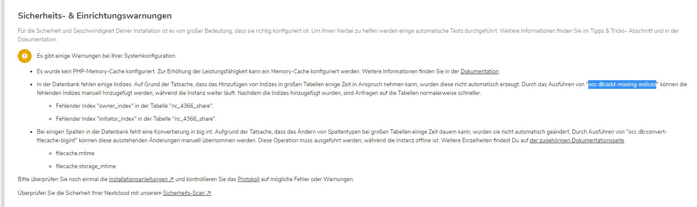

# manitu - nextcloud update, missing indexes and bigint on phpmyadmin

if you know the message before a nextcloud update, telling you, that indexes are missing and columns are int not bigint, here's how to solve it, with no access to a shell or cronjobs.
You could also put https://apps.nextcloud.com/apps/occweb on your instance, but it wouldn't work when the instance is in maintenance mode.

Keep in mind that "nc_4366_" is just a prefix, and would be different for your installation.

## 1. Indexes
**regular command:**

`sudo -u www-data php occ db:add-missing-indices`

**mysql alternative:**

``ALTER TABLE `nc_4366_share` ADD UNIQUE `owner_index` (`id`, `uid_owner`) USING BTREE;``  
``ALTER TABLE `nc_4366_share` ADD UNIQUE `initiator_index` (`id`, `uid_initiator`) USING BTREE;``

## 2. column data type
### 1. set the server to maintenance mode:
https://docs.nextcloud.com/server/9.0/admin_manual/maintenance/enable_maintenance.html

**regular command:**

`sudo -u www-data php occ maintenance:mode --on`

**alternative:**

find the file /config/config.php
download it, 
add `maintenance = true,` if no maintenance line is available.
and upload it again to enable maintenance mode.

validate it by browsing on your nextcloud instance.

### 2. perform the changes
**regular command:**

`sudo -u www-data php occ db:convert-filecache-bigint`

**mysql alternative:**

`alter table nc_4366_filecache MODIFY COLUMN mtime BIGINT(8);`  
`alter table nc_4366_filecache MODIFY COLUMN storage_mtime BIGINT(8);`

### 3. reset maintenance mode
**regular command:**

`sudo -u www-data php occ maintenance:mode --off`

**alternative:**

find the /config/config.php
change `maintenance = false,` and upload again.
https://www.manitu.de/service/faq/entry/1288/Wie-kann-ich-den-Wartungsmodus-meiner-Nextcloud-ownCloud-beenden/
validate it by browsing on your nextcloud instance.

et voilá, done.

# P.S.
## Where to find the details:
Missing Indexes: https://github.com/nextcloud/server/blob/master/core/Command/Db/AddMissingIndices.php
Missing Columns: https://github.com/nextcloud/server/blob/master/core/Command/Db/AddMissingColumns.php

## Update 16.0.4 to 17.10
- Missing Indexes:

`CREATE INDEX `twofactor_providers_uid` ON `nc_4366_twofactor_providers` (`uid`);`
`ALTER TABLE `nc_4366_whats_new` ADD UNIQUE `version` (`version`) USING BTREE;`

## Update 17.10 to 18.10
- Missing column:

`ALTER TABLE nc_4366_flow_operations add column entity character varying(256) not null;`

- Missing Indexes:

`CREATE INDEX `calendarobject_calid_index` ON `nc_4366_calendarobjects_props` (`id`, `calendartype`);`
`CREATE INDEX `schedulobj_principuri_index` ON `nc_4366_schedulingobjects` (`principaluri`);`

## Update 18.10 to 19.04
- Missing column

`ALTER TABLE `nc_4366_comments` add column reference_id varchar(64) NULL`

- Missing Indexes

`CREATE INDEX `properties_path_index` ON nc_4366_properties (`userid`, `propertypath`);`
